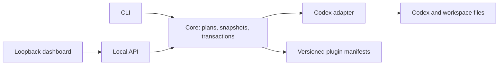

# Codex Mantle

Codex Mantle is a local-first, reversible control layer for OpenAI Codex. It helps you inspect a
Codex installation, version configuration as code, preview policy changes, create byte-exact
snapshots, and operate those capabilities from a small local dashboard.

> Alpha software. The default mode is read-only. Managed configuration mutations (`profile apply`
> and `snapshot restore`) must be planned or explicitly approved, backed up, and verified.

[简体中文](README.zh-CN.md)

## Why Mantle

Codex evolves quickly, while real workspaces accumulate global instructions, project policies,
skills, plugins, and machine-specific settings. Mantle adds a stable safety boundary without
forking Codex or depending on private protocol details:

- capability probes plus a tested-release allowlist instead of optimistic version guesses;
- plans and hash preconditions before configuration writes;
- byte-exact snapshots and explicit restore operations;
- policy packs that are reviewable in Git;
- a loopback-only dashboard and API;
- versioned adapter and plugin contracts for future integrations.

Mantle is designed for incremental adoption. `doctor` and the dashboard do not edit Codex files.
Applying a policy is a separate, auditable action. Commands that generate a plan, schema, or install
artifact write only to an explicit new, empty, or Mantle-owned destination; those outputs are not
configuration transactions and are not snapshot-managed.

## MVP capabilities

- `codex-mantle doctor` — inspect Node, Git, PowerShell, GitHub CLI, Codex, and local capabilities.
- `codex-mantle compatibility probe` — detect the installed Codex CLI and report its proven
  capability contract without changing local state.
- `codex-mantle compatibility schema --output <empty-directory>` — explicitly generate the
  installed CLI's version-specific app-server schema for local inspection.
- `codex-mantle snapshot create|list|inspect|restore` — protect selected files with SHA-256 manifests.
- `codex-mantle profile plan|apply` — resolve a policy pack, show exact targets and hashes, enforce
  stale-file preconditions, snapshot first, then perform a verified best-effort transaction.
- `codex-mantle plugin validate` — validate extension manifests without executing third-party code.
- `codex-mantle serve` — launch a loopback-only status dashboard.

Model routing is intentionally not part of v0.1. Mantle exposes extension boundaries for future
task dispatchers, but it does not require API keys or send workspace content to model providers.

## Quick start from source

Requirements: Node.js 22+, pnpm 11.x (verified with 11.19.0), Git, and PowerShell 7 on Windows.

```bash
git clone https://github.com/roy-reed/codex-mantle.git
cd codex-mantle
pnpm install --frozen-lockfile
pnpm check
pnpm --filter @codex-mantle/cli start -- doctor
pnpm --filter @codex-mantle/cli start -- serve --open
```

Windows users can build and install a user-local launcher:

```powershell
pwsh -File .\scripts\Install-CodexMantle.ps1
& "$env:LOCALAPPDATA\Programs\CodexMantle\bin\codex-mantle.ps1" doctor
```

The installer does not edit Codex configuration. See [Windows installation](docs/WINDOWS.md) for
upgrade and uninstall behavior.

## Safety model

Mantle follows four invariants:

1. Read-only is the fallback unless both the required capability contract and a tested Codex release
   series are recognized.
2. A plan records the expected pre-write hash of every destination.
3. Apply creates and verifies a byte-exact snapshot before touching a destination.
4. Restore requires an explicit approval value and rejects symbolic links, junctions, and drift by
   default.

State is stored outside repositories by default:

- Windows: `%LOCALAPPDATA%\CodexMantle`
- Linux/macOS: `$XDG_STATE_HOME/codex-mantle` or `~/.local/state/codex-mantle`

Override it for tests or portable use with `CODEX_MANTLE_HOME`.

Read [the threat model](docs/THREAT_MODEL.md) before enabling automation around write commands.

## Architecture



The app-server integration is behind an adapter because its generated schema is version-specific
and the transport is still evolving. The core safety operations do not depend on app-server.

See [Architecture](docs/ARCHITECTURE.md), [Compatibility](docs/COMPATIBILITY.md), and
[Roadmap](docs/ROADMAP.md).

## Project status and non-goals

v0.1 is a strong thin layer, not a replacement Codex client. It does not:

- proxy model traffic or store provider credentials;
- silently merge arbitrary TOML or Markdown;
- execute untrusted plugins;
- expose the local API to the LAN;
- scrape Codex internals or ship generated private schemas.

Those boundaries keep the initial product useful without turning every interaction into a costly
workflow.

## Inspiration and independence

The product direction was informed by the public user experiences of Codey, Codex++, and
OpenCodex. Codex Mantle is a clean-room implementation and does not copy their source. Please check
the license of every upstream project before reusing code.

Codex Mantle is an independent community project. It is not affiliated with or endorsed by OpenAI.
OpenAI and Codex are trademarks of their respective owners.

## Contributing

Read [CONTRIBUTING.md](CONTRIBUTING.md) and [SECURITY.md](SECURITY.md). The repository uses the
Apache License 2.0.
