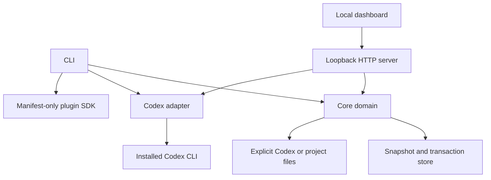

# Architecture

Codex Mantle is a local control layer around an installed Codex environment. It owns safety,
planning, snapshots, and presentation; it does not own model transport or Codex authentication.

## Design goals

- Useful in read-only mode before any configuration is adopted.
- Every managed configuration mutation is reviewable, drift-checked, recoverable, and limited to
  explicit roots. Generated plans, schemas, and install artifacts use explicit owned destinations.
- Codex version churn is contained behind capability-based adapters.
- Optional integrations add contracts, not dependencies to the transaction core.
- Normal operations add no model calls and only a small amount of local work.

## Components

### `packages/core`

The core is the only component allowed to turn desired profile state into file operations. Plans bind
the desired bytes to the current SHA-256 and allowed roots. Apply holds a state-directory mutation
lock, revalidates the plan, creates and reloads a verified byte-exact snapshot, writes through a
same-directory temporary file, and rereads the result. If a later operation fails, rollback restores
only destinations that still match bytes written by that transaction; unexpected drift is preserved
and reported rather than overwritten.

This is a verified best-effort filesystem transaction, not a claim of database isolation or
power-loss atomicity. Non-cooperating processes can still race Mantle between operating-system calls;
the alpha detects drift at its commit and rollback boundaries and documents the remaining window.

The core is independent of HTTP, React, and Codex protocol details.

### `packages/codex-adapter`

The adapter performs bounded process probes using argument arrays without a shell. It discovers the
installed CLI and app-server schema capability. A missing, unparsable, or unknown capability set is
read-only. Generated schemas are runtime evidence and are never committed automatically.

The official app-server interface is intentionally behind this boundary. Its stdio transport and
version-specific generated schema may be adopted later without changing transaction semantics. The
experimental WebSocket transport is not a v0.1 dependency. See the official
[Codex app-server documentation](https://developers.openai.com/codex/app-server).

### `packages/server` and `apps/web`

The server exposes a small JSON API and local static assets. It binds to loopback, validates `Host`
and `Origin`, emits no CORS headers, and reserves a per-process token for future mutations. The alpha
dashboard is deliberately read-only.

### `packages/plugin-sdk`

v0.1 validates strict, versioned, data-only manifests. It does not load third-party JavaScript,
shell commands, or HTML. A later out-of-process extension protocol may submit declarative plans, but
the host will remain the only writer.

## Profile packs

A profile pack is a Git-reviewable directory with a `mantle.profile.json` manifest and payload files.
The initial strategy is a named managed block inside a text file. Existing bytes outside that block,
UTF-8 BOM state, and newline convention are preserved. Arbitrary TOML round-tripping is deliberately
excluded until a parser can prove comment and unknown-key preservation.

## State and compatibility

State defaults to a user-local directory outside repositories. Snapshot IDs and transaction IDs are
opaque; manifests store paths, hashes, sizes, and payload locations but never provider credentials.
Compatibility requires both bounded output-contract probes and a tested-release allowlist. Version
text alone never enables writes. New Codex releases enter read-only mode until an adapter contract,
fixture, and acceptance run exist.

## Evolution seams

- platform-specific crash recovery can extend the portable write and ACL implementation;
- app-server and OpenCodex can be optional adapters;
- a signed, out-of-process extension protocol can replace manifest-only discovery;
- the dashboard can gain reviewed mutations without changing the loopback security boundary;
- a desktop shell can embed the server without moving core logic into the renderer.

These are seams, not v0.1 promises. Model routing and external provider credentials remain outside the
runtime architecture.
